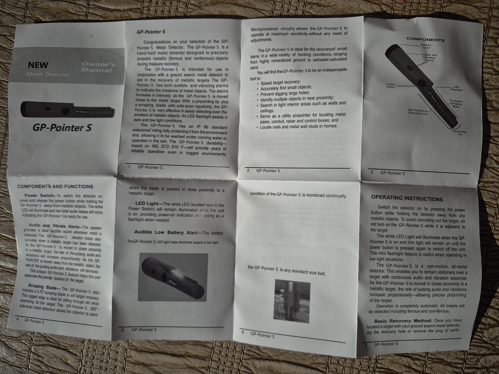
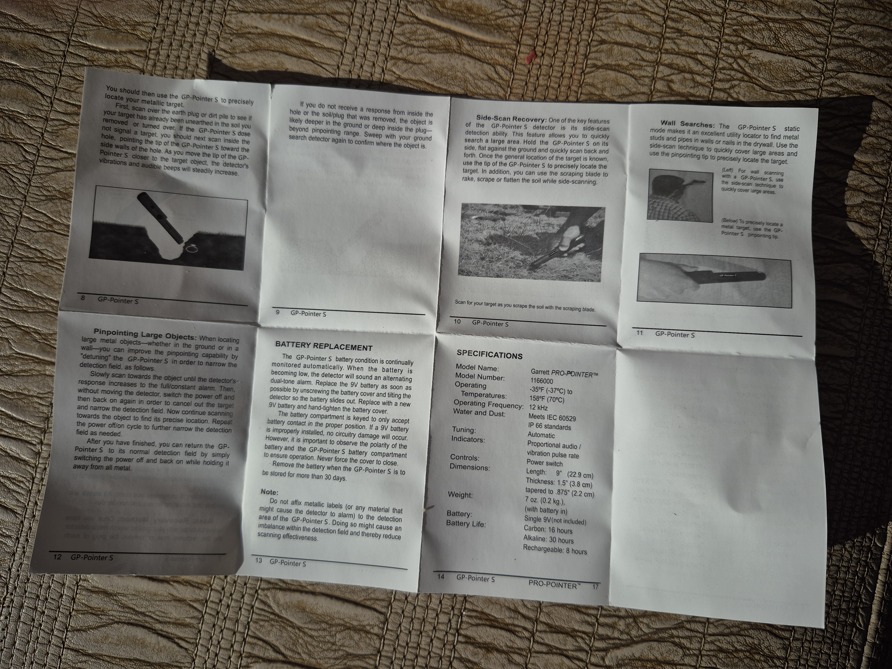

# GP-Pointer S Metal Detector Manual

This repository contains the scanned pages of the GP-Pointer S Owner's Manual.

---

## Manual Page 1 (Front)

## Manual Page 2 (Back)

---

### Quick Specifications Reference
| Feature | Details |
| :--- | :--- |
| **Model** | GP-Pointer S |
| **Waterproof Rating** | IP 66 Standard |
| **Operating Frequency** | 12 kHz |
| **Battery** | Single 9V (Alkaline: 30 hrs / Rechargeable: 8 hrs) |
| **Controls** | Power switch |
